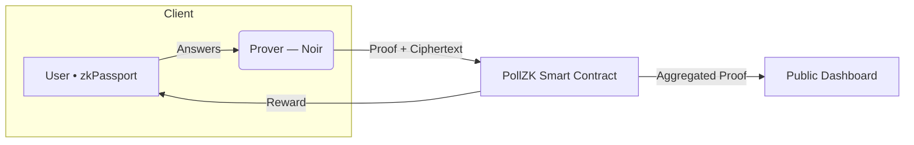
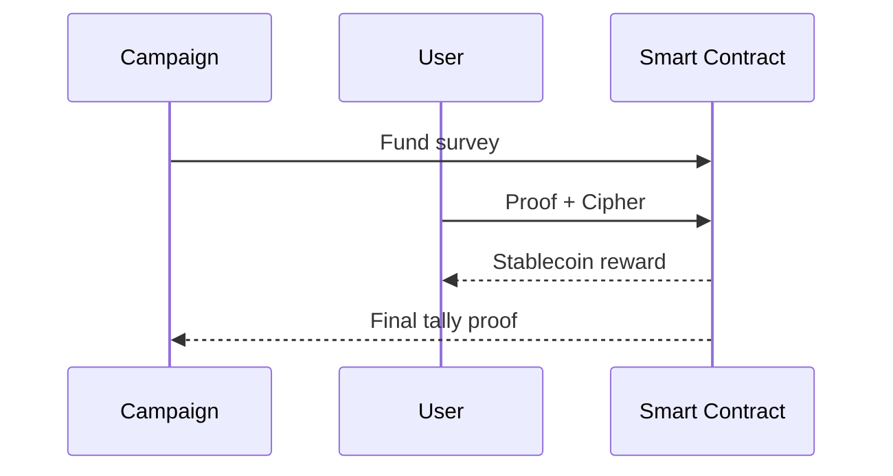

# **PollZK**

### Trust‑less Political Polling

*Proving public opinion without revealing private data*

*Noir Hackathon 2025*

---

## The Pain Today

* Campaigns burn **millions** on closed‑source pollsters
* Citizens share data **for free**
* Privacy breaches & **Sybil attacks**
* Zero public verifiability

---

## Our Solution

**PollZK** turns every survey into an on‑chain, zero‑knowledge protocol:

1. **zkPassport** credential → proves *unique human*
2. **ElGamal‑encrypted** answers → keeps votes secret
3. **Poseidon Merkle tree** → prevents double voting
4. **Direct payouts** to respondents – *no middlemen*

---

## Architecture

---

## Cryptography in 15 s

* **Poseidon root** commits each identity once
* **Nullifier hash** blocks re‑use
* **ElGamal** keeps responses unlinkable
* Solidity verifier checks the proof in \~240k gas

---

## Incentive Flow

---

## UX Demo *(GIF)*

1. Sign with zkPassport
2. Answer 5 questions
3. Click **Submit** → get paid

---

## Impact

* **90 % cost reduction** vs. legacy polling
* Respondents finally **own their data & revenue**
* Public can verify results → **Trust regained**

---

## Roadmap

|  Milestone                | Deliverable      | ETA        |
| ------------------------- | ---------------- | ---------- |
| MVP circuit & contract    | Testnet live     | **Week 1** |
| Front‑end + payouts       | Mobile‑first UI  | **Week 2** |
| Worldcoin & analytics API | Multi‑ID support | Post‑hack  |

---

## Ask

🏗 **Looking for:**

* Feedback on incentive model
* Beta campaigns & civic partners
* Funding ⇢ scaling gas subsidies

> *Let’s upgrade democracy to proof‑based polling.*

**Thank you!**
Contact: `@PollZK` · Eugenio & Team
